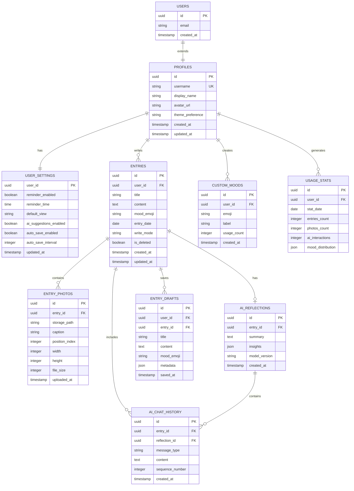

# haru 데이터베이스 구조 설계

## 1. 개요

haru 애플리케이션의 데이터베이스는 Supabase(PostgreSQL)를 기반으로 설계되었습니다. 
사용자의 감정 일기, AI 성찰 내용, 사진 등을 안전하고 효율적으로 저장하고 관리합니다.

## 2. 데이터베이스 아키텍처

### 2.1 기술 스택
- **DBMS**: PostgreSQL (Supabase)
- **인증**: Supabase Auth
- **파일 저장**: Supabase Storage
- **실시간 동기화**: Supabase Realtime
- **벡터 검색**: Supabase Vector (향후 확장)

### 2.2 주요 특징
- Row Level Security (RLS)를 통한 데이터 보안
- 자동 타임스탬프 관리
- 소프트 삭제 지원
- 효율적인 인덱싱

## 3. Entity Relationship Diagram



## 4. 테이블 상세 설계

### 4.1 사용자 관련 테이블

#### profiles (사용자 프로필)
```sql
CREATE TABLE profiles (
    id UUID PRIMARY KEY REFERENCES auth.users(id) ON DELETE CASCADE,
    username TEXT UNIQUE NOT NULL,
    display_name TEXT,
    avatar_url TEXT,
    theme_preference TEXT DEFAULT 'pink',
    created_at TIMESTAMPTZ DEFAULT NOW(),
    updated_at TIMESTAMPTZ DEFAULT NOW()
);

-- 트리거: updated_at 자동 업데이트
CREATE TRIGGER update_profiles_updated_at
    BEFORE UPDATE ON profiles
    FOR EACH ROW
    EXECUTE FUNCTION update_updated_at_column();
```

#### user_settings (사용자 설정)
```sql
CREATE TABLE user_settings (
    user_id UUID PRIMARY KEY REFERENCES profiles(id) ON DELETE CASCADE,
    reminder_enabled BOOLEAN DEFAULT false,
    reminder_time TIME,
    default_view TEXT DEFAULT 'calendar' CHECK (default_view IN ('calendar', 'timeline')),
    ai_suggestions_enabled BOOLEAN DEFAULT true,
    auto_save_enabled BOOLEAN DEFAULT true,
    auto_save_interval INTEGER DEFAULT 30, -- seconds
    updated_at TIMESTAMPTZ DEFAULT NOW()
);
```

### 4.2 일기 관련 테이블

#### entries (일기 항목)
```sql
CREATE TABLE entries (
    id UUID PRIMARY KEY DEFAULT gen_random_uuid(),
    user_id UUID NOT NULL REFERENCES profiles(id) ON DELETE CASCADE,
    title TEXT NOT NULL,
    content TEXT NOT NULL,
    mood_emoji TEXT NOT NULL,
    entry_date DATE NOT NULL DEFAULT CURRENT_DATE,
    write_mode TEXT DEFAULT 'journal' CHECK (write_mode IN ('journal', 'chat')),
    is_deleted BOOLEAN DEFAULT false,
    created_at TIMESTAMPTZ DEFAULT NOW(),
    updated_at TIMESTAMPTZ DEFAULT NOW()
);

-- 하루 3개 제한을 위한 함수
CREATE OR REPLACE FUNCTION check_daily_entry_limit()
RETURNS TRIGGER AS $$
BEGIN
    IF (
        SELECT COUNT(*)
        FROM entries
        WHERE user_id = NEW.user_id
        AND entry_date = NEW.entry_date
        AND is_deleted = false
    ) >= 3 THEN
        RAISE EXCEPTION 'Daily entry limit (3) exceeded';
    END IF;
    RETURN NEW;
END;
$$ LANGUAGE plpgsql;

CREATE TRIGGER enforce_daily_entry_limit
    BEFORE INSERT ON entries
    FOR EACH ROW
    EXECUTE FUNCTION check_daily_entry_limit();
```

#### entry_photos (일기 사진)
```sql
CREATE TABLE entry_photos (
    id UUID PRIMARY KEY DEFAULT gen_random_uuid(),
    entry_id UUID NOT NULL REFERENCES entries(id) ON DELETE CASCADE,
    storage_path TEXT NOT NULL,
    caption TEXT,
    position_index INTEGER NOT NULL,
    width INTEGER,
    height INTEGER,
    file_size INTEGER, -- bytes
    uploaded_at TIMESTAMPTZ DEFAULT NOW()
);
```

#### entry_drafts (임시 저장)
```sql
CREATE TABLE entry_drafts (
    id UUID PRIMARY KEY DEFAULT gen_random_uuid(),
    user_id UUID NOT NULL REFERENCES profiles(id) ON DELETE CASCADE,
    entry_id UUID REFERENCES entries(id) ON DELETE CASCADE, -- NULL for new entries
    title TEXT,
    content TEXT,
    mood_emoji TEXT,
    metadata JSONB DEFAULT '{}', -- 사진 정보, 작성 모드 등
    saved_at TIMESTAMPTZ DEFAULT NOW()
);

-- 사용자당 하나의 임시저장만 유지
CREATE UNIQUE INDEX idx_one_draft_per_user 
ON entry_drafts(user_id) 
WHERE entry_id IS NULL;
```

### 4.3 AI 관련 테이블

#### ai_reflections (AI 성찰)
```sql
CREATE TABLE ai_reflections (
    id UUID PRIMARY KEY DEFAULT gen_random_uuid(),
    entry_id UUID NOT NULL REFERENCES entries(id) ON DELETE CASCADE,
    summary TEXT NOT NULL,
    insights JSONB DEFAULT '[]', -- 구조화된 인사이트
    model_version TEXT DEFAULT 'gpt-4',
    created_at TIMESTAMPTZ DEFAULT NOW()
);

-- 일기당 하나의 성찰만 허용
CREATE UNIQUE INDEX idx_one_reflection_per_entry ON ai_reflections(entry_id);
```

#### ai_chat_history (AI 대화 기록)
```sql
CREATE TABLE ai_chat_history (
    id UUID PRIMARY KEY DEFAULT gen_random_uuid(),
    entry_id UUID REFERENCES entries(id) ON DELETE CASCADE,
    reflection_id UUID REFERENCES ai_reflections(id) ON DELETE CASCADE,
    message_type TEXT NOT NULL CHECK (message_type IN ('user', 'ai')),
    content TEXT NOT NULL,
    sequence_number INTEGER NOT NULL,
    created_at TIMESTAMPTZ DEFAULT NOW(),
    
    -- 일기 작성 중 대화 또는 성찰 대화
    CONSTRAINT chat_context CHECK (
        (entry_id IS NOT NULL AND reflection_id IS NULL) OR 
        (entry_id IS NULL AND reflection_id IS NOT NULL)
    )
);
```

### 4.4 기타 테이블

#### custom_moods (커스텀 감정)
```sql
CREATE TABLE custom_moods (
    id UUID PRIMARY KEY DEFAULT gen_random_uuid(),
    user_id UUID NOT NULL REFERENCES profiles(id) ON DELETE CASCADE,
    emoji TEXT NOT NULL,
    label TEXT,
    usage_count INTEGER DEFAULT 0,
    created_at TIMESTAMPTZ DEFAULT NOW()
);

-- 사용자당 이모지 중복 방지
CREATE UNIQUE INDEX idx_unique_emoji_per_user ON custom_moods(user_id, emoji);
```

#### usage_stats (사용 통계)
```sql
CREATE TABLE usage_stats (
    id UUID PRIMARY KEY DEFAULT gen_random_uuid(),
    user_id UUID NOT NULL REFERENCES profiles(id) ON DELETE CASCADE,
    stat_date DATE NOT NULL,
    entries_count INTEGER DEFAULT 0,
    photos_count INTEGER DEFAULT 0,
    ai_interactions INTEGER DEFAULT 0,
    mood_distribution JSONB DEFAULT '{}', -- {"😊": 5, "😢": 2, ...}
    CONSTRAINT unique_daily_stat UNIQUE (user_id, stat_date)
);
```

## 5. 인덱스 설계

```sql
-- 성능 최적화를 위한 인덱스
CREATE INDEX idx_entries_user_date ON entries(user_id, entry_date DESC) WHERE is_deleted = false;
CREATE INDEX idx_entries_created ON entries(created_at DESC) WHERE is_deleted = false;
CREATE INDEX idx_photos_entry ON entry_photos(entry_id, position_index);
CREATE INDEX idx_reflections_entry ON ai_reflections(entry_id);
CREATE INDEX idx_chat_history_entry ON ai_chat_history(entry_id, sequence_number);
CREATE INDEX idx_chat_history_reflection ON ai_chat_history(reflection_id, sequence_number);
CREATE INDEX idx_custom_moods_user ON custom_moods(user_id, usage_count DESC);
CREATE INDEX idx_stats_user_date ON usage_stats(user_id, stat_date DESC);

-- 전문 검색을 위한 인덱스 (선택적)
CREATE INDEX idx_entries_search ON entries 
USING gin(to_tsvector('korean', title || ' ' || content)) 
WHERE is_deleted = false;
```

## 6. Row Level Security (RLS) 정책

```sql
-- RLS 활성화
ALTER TABLE profiles ENABLE ROW LEVEL SECURITY;
ALTER TABLE user_settings ENABLE ROW LEVEL SECURITY;
ALTER TABLE entries ENABLE ROW LEVEL SECURITY;
ALTER TABLE entry_photos ENABLE ROW LEVEL SECURITY;
ALTER TABLE entry_drafts ENABLE ROW LEVEL SECURITY;
ALTER TABLE ai_reflections ENABLE ROW LEVEL SECURITY;
ALTER TABLE ai_chat_history ENABLE ROW LEVEL SECURITY;
ALTER TABLE custom_moods ENABLE ROW LEVEL SECURITY;
ALTER TABLE usage_stats ENABLE ROW LEVEL SECURITY;

-- profiles 정책
CREATE POLICY "Users can view own profile" ON profiles
    FOR SELECT USING (auth.uid() = id);
    
CREATE POLICY "Users can update own profile" ON profiles
    FOR UPDATE USING (auth.uid() = id);

-- entries 정책
CREATE POLICY "Users can CRUD own entries" ON entries
    FOR ALL USING (auth.uid() = user_id);

-- entry_photos 정책
CREATE POLICY "Users can manage photos of own entries" ON entry_photos
    FOR ALL USING (
        EXISTS (
            SELECT 1 FROM entries 
            WHERE entries.id = entry_photos.entry_id 
            AND entries.user_id = auth.uid()
        )
    );

-- 기타 테이블들도 동일한 패턴으로 정책 적용
```

## 7. 데이터 마이그레이션 및 백업 전략

### 7.1 마이그레이션
- Supabase CLI를 통한 마이그레이션 관리
- 각 스키마 변경사항은 버전 관리
- 롤백 가능한 마이그레이션 스크립트 작성

### 7.2 백업
- Supabase 자동 백업 (Point-in-time Recovery)
- 주간 전체 백업
- 중요 데이터 일일 증분 백업

### 7.3 데이터 보존
- 삭제된 일기는 30일간 보관 (is_deleted = true)
- AI 대화 기록은 영구 보존
- 사용자 탈퇴 시 익명화 처리

## 8. 성능 고려사항

### 8.1 쿼리 최적화
- 복합 인덱스를 통한 빠른 조회
- 페이지네이션 적용 (cursor-based)
- 불필요한 JOIN 최소화

### 8.2 캐싱 전략
- 자주 조회되는 데이터 Redis 캐싱 (향후)
- 정적 데이터 CDN 캐싱
- API 응답 캐싱

### 8.3 확장성
- 파티셔닝 준비 (entry_date 기준)
- 읽기 전용 복제본 활용
- 비동기 작업 큐 도입 (AI 처리)

## 9. 보안 고려사항

### 9.1 데이터 암호화
- 전송 중 암호화 (HTTPS/TLS)
- 저장 시 암호화 (Supabase 기본 제공)
- 민감 정보 추가 암호화

### 9.2 접근 제어
- RLS를 통한 데이터 격리
- API 키 관리
- Rate limiting

### 9.3 감사 로그
- 중요 작업 로깅
- 접근 기록 보관
- 이상 행동 탐지

## 10. 향후 확장 계획

### 10.1 추가 기능
- 태그 시스템
- 일기 공유 기능
- 그룹 일기장
- 음성 메모

### 10.2 AI 고도화
- 벡터 임베딩 저장
- 유사 일기 검색
- 감정 패턴 분석
- 맞춤형 추천

### 10.3 분석 기능
- 상세 통계 대시보드
- 감정 트렌드 분석
- 연간 리포트
- 데이터 시각화