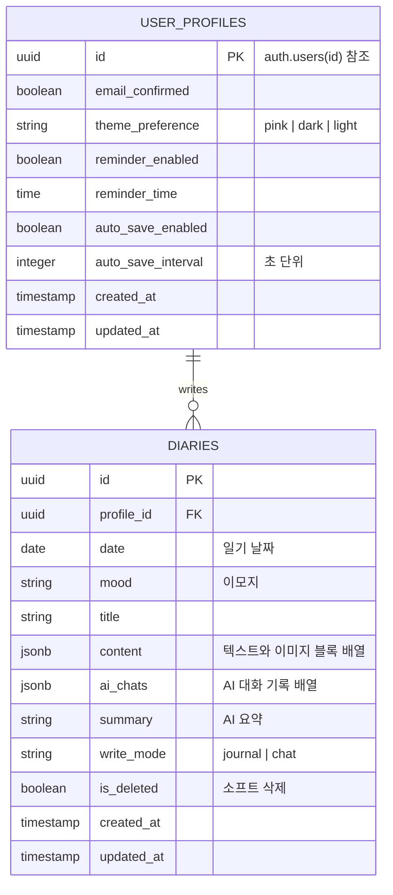

# haru 데이터베이스 구조 설계 (간소화 버전)

## 1. 개요

haru 애플리케이션의 간소화된 데이터베이스 구조입니다. 
MVP 개발을 위해 **2개 테이블만**으로 핵심 기능에 집중하고, JSONB 필드를 활용하여 유연성을 확보했습니다.

## 2. 기술 스택

- **DBMS**: PostgreSQL (Supabase)
- **인증**: Supabase Auth
- **파일 저장**: Supabase Storage
- **보안**: Row Level Security (RLS)

## 3. Entity Relationship Diagram



### 핵심 특징:
- 2개 테이블만으로 모든 기능 구현
- 이미지는 content JSON 배열에 통합
- AI 대화는 ai_chats JSON 배열에 저장
- Supabase Auth와 완전 통합

## 4. 테이블 구조

### 4.1 user_profiles (사용자 프로필 및 설정)

```sql
CREATE TABLE user_profiles (
    id UUID PRIMARY KEY REFERENCES auth.users(id) ON DELETE CASCADE,
    email_confirmed BOOLEAN DEFAULT false,
    
    -- 사용자 설정
    theme_preference TEXT DEFAULT 'pink',
    reminder_enabled BOOLEAN DEFAULT false,
    reminder_time TIME,
    auto_save_enabled BOOLEAN DEFAULT true,
    auto_save_interval INTEGER DEFAULT 30, -- 초 단위
    
    -- 타임스탬프
    created_at TIMESTAMPTZ DEFAULT NOW(),
    updated_at TIMESTAMPTZ DEFAULT NOW()
);

-- updated_at 자동 업데이트 트리거
CREATE TRIGGER update_user_profiles_updated_at
    BEFORE UPDATE ON user_profiles
    FOR EACH ROW
    EXECUTE FUNCTION update_updated_at_column();
```

### 4.2 diaries (일기 항목)

```sql
CREATE TABLE diaries (
    id UUID PRIMARY KEY DEFAULT gen_random_uuid(),
    profile_id UUID NOT NULL REFERENCES user_profiles(id) ON DELETE CASCADE,
    
    -- 기본 정보
    date DATE NOT NULL,
    mood TEXT NOT NULL,
    title TEXT,
    
    -- JSON 필드로 유연성 확보
    content JSONB NOT NULL DEFAULT '[]', -- paragraph와 image 블록 배열
    ai_chats JSONB DEFAULT '[]', -- speaker, message, timestamp 배열
    
    -- 메타 정보
    summary TEXT,
    write_mode TEXT DEFAULT 'journal' CHECK (write_mode IN ('journal', 'chat')),
    
    -- 소프트 삭제
    is_deleted BOOLEAN DEFAULT false,
    
    -- 타임스탬프
    created_at TIMESTAMPTZ DEFAULT NOW(),
    updated_at TIMESTAMPTZ DEFAULT NOW()
);

-- updated_at 자동 업데이트 트리거
CREATE TRIGGER update_diaries_updated_at
    BEFORE UPDATE ON diaries
    FOR EACH ROW
    EXECUTE FUNCTION update_updated_at_column();

-- 하루 3개 제한 함수
CREATE OR REPLACE FUNCTION check_daily_entry_limit()
RETURNS TRIGGER AS $$
BEGIN
    IF (
        SELECT COUNT(*)
        FROM diaries
        WHERE profile_id = NEW.profile_id
        AND date = NEW.date
        AND is_deleted = false
    ) >= 3 THEN
        RAISE EXCEPTION 'Daily entry limit (3) exceeded';
    END IF;
    RETURN NEW;
END;
$$ LANGUAGE plpgsql;

CREATE TRIGGER enforce_daily_entry_limit
    BEFORE INSERT ON diaries
    FOR EACH ROW
    EXECUTE FUNCTION check_daily_entry_limit();
```


## 5. JSON 필드 구조 예시

### 5.1 content 필드 구조
```json
[
  {
    "type": "paragraph",
    "text": "오늘 아침 일찍 일어나서 산책을 다녀왔다. 공기가 정말 맑고 상쾌했다."
  },
  {
    "type": "image",
    "url": "https://[project-id].supabase.co/storage/v1/object/public/diary-images/2025/09/04/morning-walk.jpg",
    "caption": "아침 산책길",
    "meta": {
      "width": 1024,
      "height": 768,
      "size": 245760
    }
  },
  {
    "type": "paragraph",
    "text": "산책 후에는 카페에서 커피를 마시며 책을 읽었다. 오랜만에 여유로운 시간이었다."
  }
]
```

**구조 설명:**
- 배열 인덱스(0, 1, 2...)가 블록 순서를 나타냄
- `type`: "paragraph" | "image" 
- `text`: 텍스트 내용 (paragraph 타입)
- `url`: Supabase Storage 이미지 URL (image 타입)
- `caption`: 이미지 설명 (선택)
- `meta`: 이미지 메타데이터 (width, height, size)

### 5.2 ai_chats 필드 구조
```json
[
  {
    "speaker": "user",
    "message": "오늘 있었던 일을 정리하고 싶어",
    "timestamp": "2025-09-04T10:30:00Z"
  },
  {
    "speaker": "assistant",
    "message": "오늘 하루는 어떠셨나요? 특별히 기억에 남는 순간이 있었나요?",
    "timestamp": "2025-09-04T10:30:05Z"
  },
  {
    "speaker": "user",
    "message": "아침에 산책을 했는데 정말 상쾌했어. 그리고 오랜만에 책도 읽었고.",
    "timestamp": "2025-09-04T10:30:30Z"
  },
  {
    "speaker": "assistant",
    "message": "아침 산책과 독서라니, 정말 여유로운 하루를 보내셨네요! 어떤 책을 읽으셨나요? 그리고 산책하면서 어떤 생각이 드셨는지 궁금해요.",
    "timestamp": "2025-09-04T10:30:45Z"
  }
]
```

**구조 설명:**
- `speaker`: "user" | "assistant" (화자 구분)
- `message`: 대화 내용
- `timestamp`: ISO 8601 형식의 메시지 시간

## 6. 인덱스

```sql
-- 사용자별 일기 조회 성능 향상
CREATE INDEX idx_diaries_user_date ON diaries(profile_id, date DESC) 
WHERE is_deleted = false;

-- 생성일 기준 정렬용
CREATE INDEX idx_diaries_created ON diaries(created_at DESC) 
WHERE is_deleted = false;

```

## 7. Row Level Security (RLS)

```sql
-- RLS 활성화
ALTER TABLE user_profiles ENABLE ROW LEVEL SECURITY;
ALTER TABLE diaries ENABLE ROW LEVEL SECURITY;

-- user_profiles 정책
CREATE POLICY "Users can CRUD own profile" ON user_profiles
    FOR ALL USING (auth.uid() = id);

-- diaries 정책
CREATE POLICY "Users can CRUD own diaries" ON diaries
    FOR ALL USING (auth.uid() = profile_id);
```

## 8. 헬퍼 함수

```sql
-- updated_at 자동 업데이트 함수
CREATE OR REPLACE FUNCTION update_updated_at_column()
RETURNS TRIGGER AS $$
BEGIN
    NEW.updated_at = NOW();
    RETURN NEW;
END;
$$ LANGUAGE plpgsql;

```

## 9. 장점

### 9.1 단순함
- 2개의 핵심 테이블로 모든 기능 구현
- 복잡한 조인 최소화
- 빠른 개발과 유지보수

### 9.2 유연성  
- JSON 필드로 스키마 변경 없이 기능 추가 가능
- AI 대화 형식 변경에 유연하게 대응
- 콘텐츠 구조 확장 용이

### 9.3 성능
- 인덱스를 통한 빠른 조회
- JSON 필드로 N+1 쿼리 문제 해결
- 필요한 데이터만 선택적 로드 가능

## 10. 마무리

이 구조는 **최소한의 테이블로 최대한의 기능**을 구현하는 MVP 중심 설계입니다.

### 핵심 철학:
- **단순함**: 2개 테이블로 모든 핵심 기능 구현
- **유연성**: JSONB로 스키마 변경 없이 기능 확장
- **안전성**: RLS로 사용자 데이터 완벽 격리
- **확장성**: 필요 시 점진적 테이블 추가 가능

MVP 출시 후 사용자 피드백에 따라 필요한 기능만 선별적으로 추가하는 것을 권장합니다.