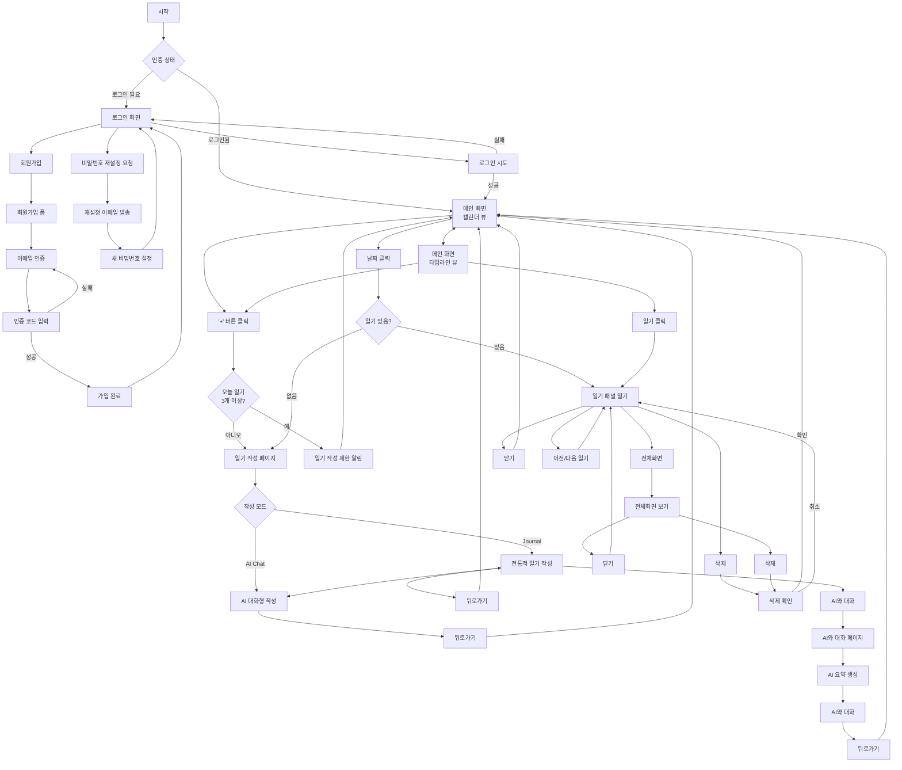

# haru - 디지털 감정 일기 요건 정의서

## 1. 기능 일람

### 1.1 사용자 인증 기능
| 기능 ID | 기능명 | 설명 | 우선순위 |
|---------|--------|------|----------|
| AUTH-01 | 회원가입 | 이메일/비밀번호로 신규 계정 생성 | 필수 |
| AUTH-02 | 로그인 | 이메일/비밀번호로 로그인 | 필수 |
| AUTH-03 | 로그아웃 | 현재 세션 종료 | 필수 |
| AUTH-04 | 비밀번호 재설정 | 이메일을 통한 비밀번호 재설정 | 필수 |
| AUTH-05 | 소셜 로그인 | Google/GitHub 계정으로 로그인 | 선택 |

### 1.2 일기 작성 기능
| 기능 ID | 기능명 | 설명 | 우선순위 |
|---------|--------|------|----------|
| WRITE-01 | Journal 모드 | 전통적인 방식으로 제목, 내용 직접 작성 | 필수 |
| WRITE-02 | AI Chat 모드 | AI와 대화하며 일기 내용 구성 | 필수 |
| WRITE-03 | 사진 첨부 | 일기에 여러 장의 사진 첨부 | 필수 |
| WRITE-04 | 실시간 자동 저장 | 입력 내용을 실시간으로 자동 저장 (노션 방식) | 필수 |
| WRITE-05 | 기분 커스텀 | 커스텀 이모지 추가 | 필수 |

### 1.3 일기 조회 기능
| 기능 ID | 기능명 | 설명 | 우선순위 |
|---------|--------|------|----------|
| VIEW-01 | 캘린더 뷰 | 월별 감정 캘린더 표시 | 필수 |
| VIEW-02 | 타임라인 뷰 | 시간순 일기 목록 표시 | 필수 |
| VIEW-03 | 일기 상세보기 | 개별 일기 전체 내용 조회 | 필수 |
| VIEW-04 | 일기 검색 | 키워드로 일기 검색 | 선택 |
| VIEW-05 | 기분별 필터링 | 특정 기분의 일기만 표시 | 선택 |

### 1.4 AI 기능
| 기능 ID | 기능명 | 설명 | 우선순위 |
|---------|--------|------|----------|
| AI-01 | AI와 대화 | 작성된 일기에 대한 AI 요약 및 대화 | 필수 |
| AI-02 | AI 요약 | AI가 일기 내용을 분석하여 핵심 요약 생성 | 필수 |
| AI-03 | 타임라인 요약 표시 | 타임라인에 AI 요약 내용 표시 | 필수 |
| AI-04 | 감정 패턴 분석 | 장기간 감정 변화 분석 | 선택 |

### 1.5 일기 관리 기능
| 기능 ID | 기능명 | 설명 | 우선순위 |
|---------|--------|------|----------|
| MANAGE-01 | 일기 인라인 편집 | 일기 조회 중 바로 편집 가능 (노션 방식) | 필수 |
| MANAGE-02 | 일기 삭제 | 작성된 일기 삭제 | 필수 |
| MANAGE-03 | 일기 작성 | 신규 일기 작성 | 선택 |
| MANAGE-04 | 데이터 백업 | 전체 일기 데이터 백업 | 선택 |

## 2. 화면 일람

### 2.1 인증 관련 화면
| 화면 ID | 화면명 | 설명 | 경로 |
|---------|--------|------|------|
| SC-AUTH-01 | 로그인 | 이메일/비밀번호 입력 폼 | /login |
| SC-AUTH-02 | 회원가입 | 계정 생성 폼 | /register |
| SC-AUTH-03 | 이메일 인증 | 인증 이메일 발송 안내 | /verify-email |
| SC-AUTH-04 | 인증 코드 입력 | 6자리 인증 코드 입력 | /verify-code |
| SC-AUTH-05 | 가입 완료 | 계정 생성 완료 안내 | /register-complete |
| SC-AUTH-06 | 비밀번호 재설정 요청 | 이메일 입력으로 재설정 요청 | /reset-password |
| SC-AUTH-07 | 비밀번호 재설정 이메일 발송 | 재설정 이메일 발송 안내 | /reset-email-sent |
| SC-AUTH-08 | 새 비밀번호 설정 | 새 비밀번호 입력 및 확인 | /reset-password/confirm |

### 2.2 메인 화면
| 화면 ID | 화면명 | 설명 | 경로 |
|---------|--------|------|------|
| SC-MAIN-01 | 캘린더 뷰 | 월별 감정 캘린더 | /calendar |
| SC-MAIN-02 | 타임라인 뷰 | 일기 목록 타임라인 | /timeline |
| SC-MAIN-03 | 사이드바 | 네비게이션 메뉴 | (컴포넌트) |

### 2.3 일기 관련 화면
| 화면 ID | 화면명 | 설명 | 경로 |
|---------|--------|------|------|
| SC-ENTRY-01 | 일기 작성 | 새 일기 작성 화면 | /write |
| SC-ENTRY-02 | 일기 상세 | 일기 상세 보기 패널 | /entry/[id] |
| SC-ENTRY-03 | 일기 전체화면 | 일기 전체화면 보기 | /entry/[id]/full |
| SC-ENTRY-04 | AI 성찰 | AI 성찰 대화 화면 | /reflect/[id] |

### 2.4 모달/팝업
| 화면 ID | 화면명 | 설명 | 
|---------|--------|------|
| SC-MODAL-01 | 일기 선택 | 동일 날짜 복수 일기 선택 |
| SC-MODAL-02 | 삭제 확인 | 일기 삭제 확인 다이얼로그 |
| SC-MODAL-03 | 사진 업로드 | 사진 선택 및 업로드 |
| SC-MODAL-04 | 사진 삭제 | 사진 삭제 확인 다이얼로그 |

## 3. 화면 전이

### 3.1 주요 화면 전이 흐름



### 3.2 상세 화면 전이

| 시작 화면 | 액션 | 도착 화면 | 조건 |
|-----------|------|-----------|------|
| 시작 | 앱 접속 | 로그인 화면 | 비로그인 상태 |
| 시작 | 앱 접속 | 캘린더 뷰 | 로그인 상태 |
| 로그인 화면 | 회원가입 클릭 | 회원가입 폼 | - |
| 회원가입 폼 | 폼 제출 | 이메일 인증 | 인증 이메일 발송 |
| 이메일 인증 | 인증 코드 입력 | 인증 코드 입력 페이지 | - |
| 인증 코드 입력 | 인증 성공 | 가입 완료 | 계정 생성 완료 |
| 인증 코드 입력 | 인증 실패 | 이메일 인증 | 재시도 |
| 가입 완료 | 확인 | 로그인 화면 | 로그인 가능 상태 |
| 로그인 화면 | 로그인 성공 | 캘린더 뷰 | 인증 성공 |
| 로그인 화면 | 비밀번호 재설정 클릭 | 비밀번호 재설정 요청 | 이메일 입력 |
| 비밀번호 재설정 요청 | 이메일 제출 | 재설정 이메일 발송 | 재설정 링크 이메일 발송 |
| 재설정 이메일 발송 | 이메일 링크 클릭 | 새 비밀번호 설정 | 이메일에서 접근 |
| 새 비밀번호 설정 | 비밀번호 변경 완료 | 로그인 화면 | 새 비밀번호로 로그인 가능 |
| 캘린더 뷰 | 날짜 클릭 | 일기 작성 페이지 | 해당 날짜 일기 없음 |
| 캘린더 뷰 | 날짜 클릭 | 일기 패널 열기 | 해당 날짜 일기 있음 |
| 캘린더/타임라인 | + 버튼 클릭 | 일기 작성 페이지 | 오늘 일기 3개 미만 |
| 캘린더/타임라인 | + 버튼 클릭 | 일기 작성 제한 알림 | 오늘 일기 3개 (더 이상 작성 불가) |
| 타임라인 뷰 | 일기 클릭 | 일기 패널 열기 | - |
| 일기 작성 페이지 | 모드 전환 | Journal ↔ AI Chat | 작성 중 전환 가능 |
| Journal 모드 | 뒤로가기 | 메인 화면 | 자동 저장된 상태 |
| Journal 모드 | AI와 대화 | AI와 대화 페이지 | 일기 내용 기반 AI 대화 |
| AI Chat 모드 | 뒤로가기 | 메인 화면 | 자동 저장된 상태 (AI 요약 포함) |
| 일기 패널 | 인라인 편집 | 일기 패널 | 바로 편집 가능, 자동 저장 |
| 일기 패널 | 삭제 | 삭제 확인 | - |
| 일기 패널 | 전체화면 | 전체화면 보기 | 데스크톱만 |
| 일기 패널 | 이전/다음 | 일기 패널 | 다른 일기로 이동 |
| 삭제 확인 | 확인 | 메인 화면 | 일기 삭제 후 |
| 삭제 확인 | 취소 | 일기 패널 | - |
| 전체화면 보기 | 인라인 편집 | 전체화면 보기 | 바로 편집 가능, 자동 저장 |
| 전체화면 보기 | 삭제 | 삭제 확인 | - |
| 전체화면 보기 | 닫기 | 일기 패널 | - |
| AI와 대화 | 뒤로가기 | 메인 화면 | AI 대화 내용 자동 저장됨 |

## 4. 데이터 정의 (스키마)

### 4.1 사용자 관련

```sql
-- 사용자 프로필 (Supabase Auth 확장)
CREATE TABLE profiles (
    id UUID PRIMARY KEY REFERENCES auth.users(id),
    username TEXT UNIQUE,
    display_name TEXT,
    avatar_url TEXT,
    theme_preference TEXT DEFAULT 'pink',
    created_at TIMESTAMPTZ DEFAULT NOW(),
    updated_at TIMESTAMPTZ DEFAULT NOW()
);

-- 사용자 설정
CREATE TABLE user_settings (
    user_id UUID PRIMARY KEY REFERENCES profiles(id),
    reminder_enabled BOOLEAN DEFAULT false,
    reminder_time TIME,
    default_view TEXT DEFAULT 'calendar',
    ai_suggestions_enabled BOOLEAN DEFAULT true,
    updated_at TIMESTAMPTZ DEFAULT NOW()
);
```

### 4.2 일기 관련

```sql
-- 일기 항목
CREATE TABLE entries (
    id UUID PRIMARY KEY DEFAULT gen_random_uuid(),
    user_id UUID NOT NULL REFERENCES profiles(id),
    title TEXT NOT NULL,
    content TEXT NOT NULL,
    mood_emoji TEXT NOT NULL,
    entry_date DATE NOT NULL,
    created_at TIMESTAMPTZ DEFAULT NOW(),
    updated_at TIMESTAMPTZ DEFAULT NOW(),
    is_deleted BOOLEAN DEFAULT false,
    write_mode TEXT DEFAULT 'journal', -- 'journal' | 'chat'
    
    -- 하루 최대 3개 제한
    CONSTRAINT max_entries_per_day UNIQUE (user_id, entry_date, created_at)
);

-- 일기 사진
CREATE TABLE entry_photos (
    id UUID PRIMARY KEY DEFAULT gen_random_uuid(),
    entry_id UUID NOT NULL REFERENCES entries(id) ON DELETE CASCADE,
    storage_path TEXT NOT NULL,
    caption TEXT,
    position_index INTEGER NOT NULL,
    uploaded_at TIMESTAMPTZ DEFAULT NOW()
);

-- AI 성찰
CREATE TABLE ai_reflections (
    id UUID PRIMARY KEY DEFAULT gen_random_uuid(),
    entry_id UUID NOT NULL REFERENCES entries(id) ON DELETE CASCADE,
    summary TEXT NOT NULL,
    created_at TIMESTAMPTZ DEFAULT NOW(),
    model_version TEXT DEFAULT 'gpt-4'
);

-- AI 대화 기록
CREATE TABLE ai_chat_history (
    id UUID PRIMARY KEY DEFAULT gen_random_uuid(),
    entry_id UUID REFERENCES entries(id) ON DELETE CASCADE,
    reflection_id UUID REFERENCES ai_reflections(id) ON DELETE CASCADE,
    message_type TEXT NOT NULL, -- 'user' | 'ai'
    content TEXT NOT NULL,
    created_at TIMESTAMPTZ DEFAULT NOW(),
    
    -- 일기 작성 중 대화 또는 성찰 대화
    CONSTRAINT chat_context CHECK (
        (entry_id IS NOT NULL AND reflection_id IS NULL) OR 
        (entry_id IS NULL AND reflection_id IS NOT NULL)
    )
);
```

### 4.3 기타 데이터

```sql
-- 커스텀 이모지
CREATE TABLE custom_moods (
    id UUID PRIMARY KEY DEFAULT gen_random_uuid(),
    user_id UUID NOT NULL REFERENCES profiles(id),
    emoji TEXT NOT NULL,
    label TEXT,
    created_at TIMESTAMPTZ DEFAULT NOW()
);

-- 사용 통계 (선택)
CREATE TABLE usage_stats (
    id UUID PRIMARY KEY DEFAULT gen_random_uuid(),
    user_id UUID NOT NULL REFERENCES profiles(id),
    stat_date DATE NOT NULL,
    entries_count INTEGER DEFAULT 0,
    photos_count INTEGER DEFAULT 0,
    ai_interactions INTEGER DEFAULT 0,
    
    CONSTRAINT unique_daily_stat UNIQUE (user_id, stat_date)
);
```

### 4.4 인덱스 및 RLS 정책

```sql
-- 인덱스
CREATE INDEX idx_entries_user_date ON entries(user_id, entry_date);
CREATE INDEX idx_entries_created ON entries(created_at);
CREATE INDEX idx_photos_entry ON entry_photos(entry_id);
CREATE INDEX idx_reflections_entry ON ai_reflections(entry_id);

-- Row Level Security
ALTER TABLE entries ENABLE ROW LEVEL SECURITY;
ALTER TABLE entry_photos ENABLE ROW LEVEL SECURITY;
ALTER TABLE ai_reflections ENABLE ROW LEVEL SECURITY;

-- 사용자는 자신의 데이터만 접근
CREATE POLICY "Users can view own entries" ON entries
    FOR ALL USING (auth.uid() = user_id);
    
CREATE POLICY "Users can view own photos" ON entry_photos
    FOR ALL USING (
        EXISTS (
            SELECT 1 FROM entries 
            WHERE entries.id = entry_photos.entry_id 
            AND entries.user_id = auth.uid()
        )
    );
```

## 5. 비기능 요구사항

### 5.1 성능 요구사항
- 초기 로딩: 3초 이내
- 일기 저장: 2초 이내
- AI 응답 시작: 1초 이내
- 이미지 업로드: 5MB 이하, 10초 이내

### 5.2 보안 요구사항
- 모든 API 통신은 HTTPS 사용
- 사용자 인증 토큰은 httpOnly 쿠키 저장
- 파일 업로드 시 악성 코드 검사
- SQL Injection 방지 (Prepared Statements)
- XSS 방지 (입력값 검증 및 이스케이프)

### 5.3 사용성 요구사항
- 모바일 반응형 디자인 (추후 구현)
- 키보드 단축키 지원
- 다크 모드 지원 (추후 구현)
- 오프라인 모드 부분 지원

### 5.4 호환성
- 브라우저: Chrome 90+, Safari 14+, Firefox 88+, Edge 90+
- 최소 화면 해상도: 1024x768

## 6. 제약사항

### 6.1 기술적 제약
- Vercel 무료 플랜: 함수 실행시간 10초 제한
- Supabase 무료 플랜: 500MB 데이터베이스, 1GB 스토리지
- AI API 사용량 제한 고려

### 6.2 비즈니스 제약
- 하루 최대 3개 일기 작성 제한
- 이미지 파일 크기 5MB 제한
- 무료 사용자 AI 성찰 하루 10회 제한 (추후 검토)

## 7. 개발 우선순위

### Phase 1 (MVP)
1. 사용자 인증 (회원가입/로그인)
2. 일기 작성 (기본 모드)
3. 캘린더 뷰
4. 일기 상세 보기

### Phase 2
1. AI 대화 모드
2. AI 성찰 기능
3. 타임라인 뷰
4. 사진 첨부

### Phase 3
1. 검색 기능
2. 데이터 내보내기
3. 테마 커스터마이징
4. 모바일 최적화